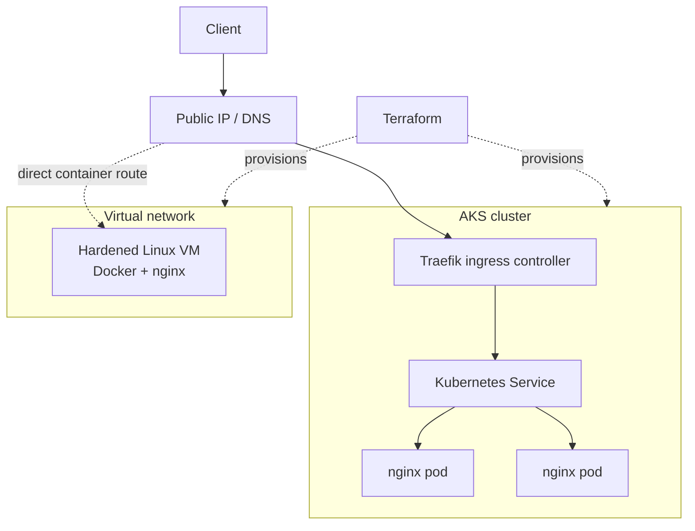

An end-to-end Azure delivery exercise carried from infrastructure definition
through to a running ingress-fronted workload, with every step captured rather
than assumed.

## Traffic path

Two delivery routes are provisioned from the same Terraform definitions: a
single hardened VM running nginx in Docker, and an AKS cluster fronted by
Traefik. The comparison is the point — the same workload, two operational
models, with the trade-offs visible rather than argued.
