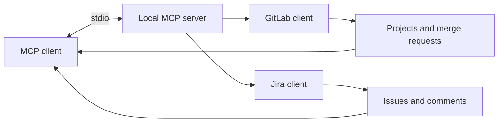

Context plumbing for coding assistants, built on the principle that the default
posture is read-only and every write is deliberate.

## Context flow

The server stays local and exposes narrowly scoped read tools. GitLab and Jira
responses are fetched only from the configured endpoints, while credentials
remain in the local environment rather than in MCP messages or source control.
