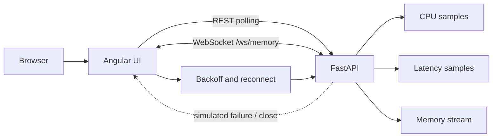

Built to fail on purpose. The interesting part is not the metrics, it is how the
client behaves when the stream drops and has to recover.

## Data and recovery paths

REST polling and WebSocket streaming deliberately fail in different ways. The
frontend keeps the failure visible, records the state transition, and retries
the stream with exponential backoff instead of silently presenting stale data.
