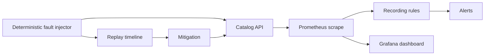

Incidents you can replay on demand. The faults are synthetic and deterministic,
which makes the resulting signals a teaching tool rather than a guess.

## Incident loop

The lab keeps the causal chain visible: inject a known fault, observe the API
signals, inspect the recorded availability and latency series, mitigate, and
verify recovery in the same local stack.
