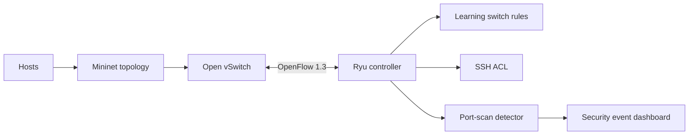

A software-defined networking lab where the controller is the security control
point: learning switch behaviour, access control, and scan detection all live in
the same OpenFlow application.

## Control loop

The emulator supplies repeatable traffic, Open vSwitch forwards packets, and
the Ryu controller decides which rules to install. ACL and scan-detection paths
feed the same event surface, so a test can verify both forwarding behaviour and
the security decision that caused it.
